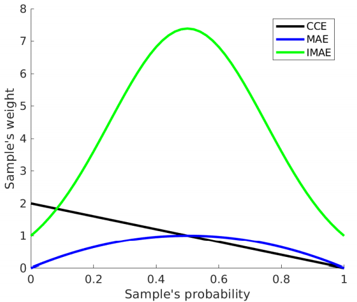
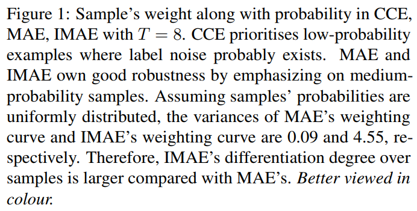
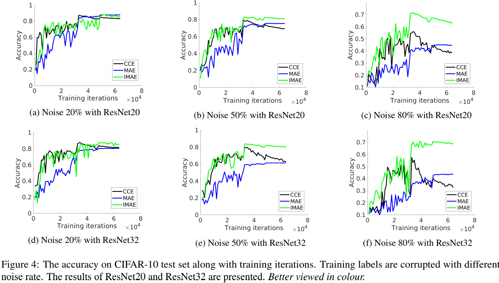
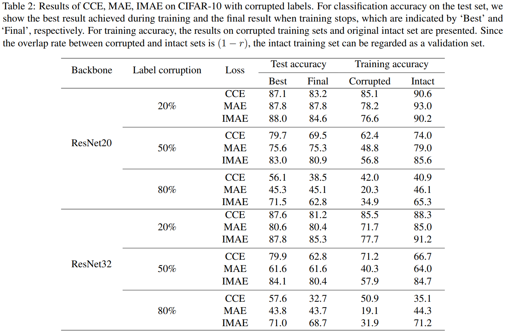
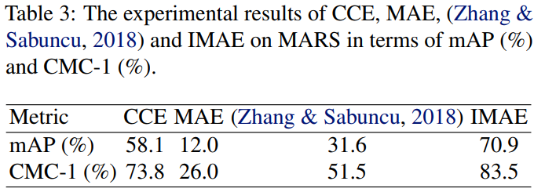
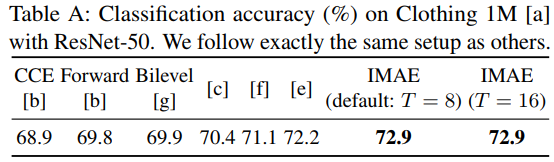
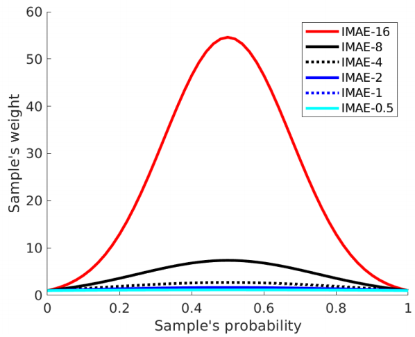
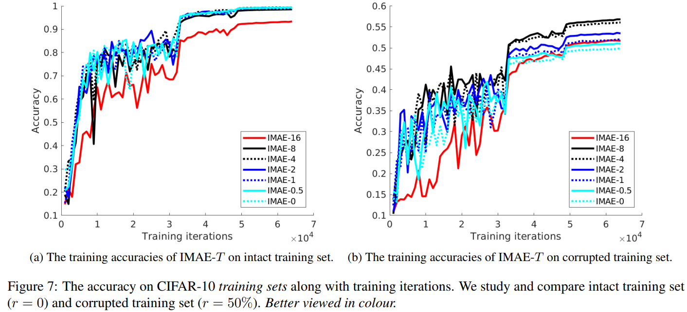
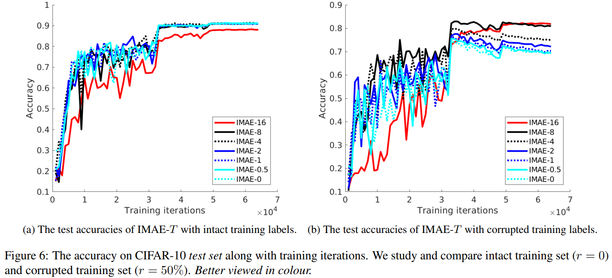

# Improving MAE’s Fitting Ability: Fundamental and Thorough Analysis with A Simple Solution
Project page for [Improving Mean Absolute Error against CCE](https://arxiv.org/pdf/1903.12141.pdf). 


**Positive comments we collected from others**
* The proposed modification IMAE is **quite simple and should be considerably more efficient than other methods that deal with label noise**.
* The theoretical analysis of CCE and MAE is thorough and provides an explanation of the tendency of CCE to
overfit to incorrect labels and the underfitting of MAE to the correct labels. 
* The experiments show a significant improvement over CCE in the case of noisy labels which validates the
approach. I also appreciate the experiment on MARS with realistic label noise.


## Introduction

**Research questions:**
* Why does MAE work much worse than CCE although it is noise-robust?
* How to improve MAE against CCE to embrace noise-robustness and high generalisation performance?

Our work is a further study of robust losses following MAE [1] and GCE [2]. They proved MAE is more robust than CCE when noise exists. However, MAE’s underfitting phenomenon is not exposed and studied in the literature. We analysed it thoroughly and proposed a simple solution to embrace both high fitting ability (accurate) and test stability (robust). 

**Our main purpose is not a proposal to push current best performance under label noise.** Instead, we focus on analysing how different losses perform differently and why, which is a fundamental research question. 

Our focus is to analyse why CCE overfits while MAE underfits as presented in ablation studies in Table 2. Under unknown real-world noise in Table 3, we only compared with GCE [2] as it is the most related and demonstrated to be the state-of-the-art.

**IMAE is suitable for cases where inputs and labels may be unmatched.**

Training DNNs requires rethinking data fitting and generalisation.
**Our main contribution is simple analysis and solution from the viewpoint of gradient magnitude with respect to logits.** 

## Takeaways


<p float="left">
  
  
</p>

* By ‘CCE is noise-sensitive and overfits training data’, we mean CCE owns high data fitting accuracy but its final test accuracy drops a lot versus its best test accuracy.
* By ‘MAE is robust’, we mean MAE’s final test accuracy drops only a bit versus its best test one.
* By ‘MAE underfits training data’, we mean its training and best test accuracies are low.

Please see our empirical evidences which can be observed in Table 2 and Figures 3, 4.


**MAE’s fitting ability is much worse than CCE. In other words, CCE overfits to incorrect labels while MAE underfits to correct labels.**
* **The robustness/sensitive to noise is from the angle of test accuracy stability/trend**, i.e., CCE’s final
test accuracy drops a lot versus its best one while MAE’s
final one is almost the same as its best one; 
* **The claim ‘MAE works worse than CCE’ is from the aspect of best test accuracy** since we generally apply early stopping to help
CCE. 

## Results

**Label noise is one of the most explict cases where some observations and their labels are not matched in the training data. In this case, it is quite crucial to make your models learn meaningful patterns instead of errors.**

### Synthetic noise






### Real-world unknown noise

**Video Person Re-identification/Retrieval on MARS [4]**



**Classification on Clothing 1M [a] is here**




## Hyper-paramter Analysis 







## Discussion

#### 1.  The idea of this paper is quite close to "training deep neural-networks using a noise adaptation layer"? They both intend to change the weight of each sample before sending to softmax, definitely they do in different ways. It decreases the novelty of this paper?

Their critical differences are: 1) Noise Adaption explicitly estimates
latent true labels by an additional softmax layer while our
IMAE reweights examples based on their input-to-label relevance
scores; 2) IMAE reweights samples **after softmax**,
i.e., scaling their gradients as shown in Eq. (22) in our paper.

#### 2. Why uniform noise (symmetric/class-independent noise )?
We choose uniform noise because it is more challenging than
asymmetric (class-dependent) noise which was verified in [d] Vahdat et al. Toward robustness against label noise in training
deep discriminative neural networks. In NeurIPS, 2017.

#### 3. Why is the performance still okay when noise rate is 80%?
By adding uniform noise, **even up to 80%, the correct portion is still the majority**, since the 80% are relocated to other 9 classes evenly.

Being natural and intuitive, the majority voting
decides the meaningful data patterns to learn. We believe that if the
noise accounts the majority, DNNs is hard to learn meaningful
patterns. Therefore, **the majority voting is our reasonable assumption.**

#### 4. The study from the gradient perspective is not new, e.g., Truncated Cauchy Non-Negative Matrix Factorization, ang GCE [2].  

Yes, we agree the perspective itself is not new. However,
we find how we analyse fundamentally and go to the simple
solution via the gradient viewpoint is novel.

Truncated Cauchy Non-Negative Matrix Factorization (TPAMI-2017) and GCE [2] truncate large errors to filter out extreme outliers. Instead, our
IMAE adjusts weighting variance without dropping any samples.

#### 5. The robustness is not specific for label noise. I think the method works well for general noise, e.g., outliers.

Yes, that is a great point. Our IMAE is suitable for all cases
where inputs and their labels are not semantically matched,
which may come from noisy data or labels. Since we only
evaluated on label noise, we did not exaggerate its efficacy.

We will test more cases in the future. 

#### 6. Is the validation data clean or not? If clean, this would greatly reduce the contribution of the paper.

Following the ML literature, a validation set should be clean as
we should not expect a ML model to predict noisy data well.
In other words, we cannot evaluate a model’s performance
on noisy validation/test data. Our goal is to avoid learning
faults from noisy data and generalise better during inference.

#### 7. More experiments with comparison to prior work and more evaluation on real-world datasets with unknown noise? 

Our focus is to analyse why CCE
overfits while MAE underfits as presented in ablation studies
in Table 2. Under unknown real-world noise in Table 3, we
only compared with GCE [2] as it is the most related and
demonstrated to be the state-of-the-art.

**Classification on Clothing 1M [a] is here**


## Citation

Please kindly cite us if you find our work useful.

```
@article{wang2019improving,
  title={Improving {MAE} against {CCE} under Label Noise},
  author={Wang, Xinshao and Kodirov, Elyor and Hua, Yang and Robertson, Neil M},
  journal={arXiv preprint arXiv:1903.12141},
  year={2019}
}
```

## References
[1] A. Ghosh, H. Kumar, and P. Sastry. Robust loss functions
under label noise for deep neural networks. In AAAI, 2017.

[2] Z. Zhang and M. R. Sabuncu. Generalized cross entropy loss
for training deep neural networks with noisy labels. In NeurIPS 2018.

[3] C. Zhang, S. Bengio, M. Hardt, B. Recht, and O. Vinyals.
Understanding deep learning requires rethinking generalization.
In ICLR, 2017.

[4] L. Zheng, Z. Bie, Y. Sun, J. Wang, C. Su, S. Wang, and
Q. Tian. Mars: A video benchmark for large-scale person
re-identification. In ECCV, 2016.

[a] Xiao et al. Learning From Massive Noisy Labeled Data for
Image Classification. In CVPR, 2015.

[b] Patrini et al. Making deep neural networks robust to label noise:
A loss correction approach. In CVPR, 2017.

[c] Goldberger et al. Training deep neural-networks using a noise
adaptation layer. In ICLR, 2017.

[d] Vahdat et al. Toward robustness against label noise in training
deep discriminative neural networks. In NeurIPS, 2017.

[e] Tanaka et al. Joint optimization framework for learning with
noisy labels. In CVPR, 2018.

[f] Han et al. Masking: A new perspective of noisy supervision. In
NeurIPS, 2018.

[g] Jenni et al. Deep bilevel learning. In ECCV, 2018.
