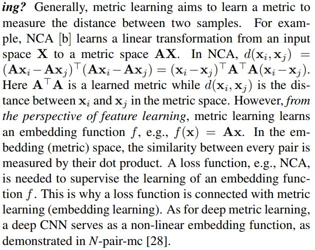

# Ranked-List-Loss-for-Deep-Metric-Learning

#### [[Paper]](https://arxiv.org/abs/1903.03238) [[Slides]](https://github.com/XinshaoAmosWang/Ranked-List-Loss-for-DML/blob/master/RLL_CVPR19_V01.pdf) [[Poster]](https://github.com/XinshaoAmosWang/Ranked-List-Loss-for-DML/blob/master/RLL_Poster_V03.pdf)

#### This work is being extended for TPAMI submission, with the main target to improve this work further. 
* **The updated codes are released!** 
* In [Unbiased Evaluation of Deep Metric Learning Algorithms--Istvan Feh ´ erv ´ ari etal 2019](https://arxiv.org/pdf/1911.12528.pdf), **it stated "On the SOP dataset, we never managed to make this algorithm converge." using [Ranked List Loss](https://arxiv.org/abs/1903.03238).**
    * First of all, I thank their interest in our work, which is a great motivation for me and my collaborators. 
    * However, their statement is not the fact. Please check our reproducible results.  
* [Paper Summary on Distance Metric, Representation Learning-Updated Blog](https://xinshaoamoswang.github.io/blogs/2020-04-23-deep-metric-learning/)

#### **In deep metric learning, The improvements over time have been marginal?** Recently, in paper [A Metric Learning Reality Check](https://arxiv.org/pdf/2003.08505.pdf), it is reported that the improvements over time have been marginal at best. Is it true? I present my personal viewpoints as follows:
* First of all, acedemic research progress is naturally slow, continuous and tortuous. Beyond, it is full of flaws on its progress. For example, in person re-identification, several years ago, some researchers horizontally split one image into several parts for alignment, which is against the design of CNNs and non-meaningful. Because deep CNNs are designed to be invariant against translation, so that hand-crafted alignment is not necessary. 
    
* There are some vital breakthroughs over the time although it seems trivial now. 
    * [Multibatch Method](https://www.cse.huji.ac.il/~shashua/papers/multibatch-nips16.pdf), after which people rarely use rigid input formats. 
        * Before this milestone, we heard a lot about Siamese networks, triplet networks, etc. 
        * After Multibatch Method, we construct doublets, triplets, or high-order relationships directly in the feature space.
    * The importance of sample mining/weighting becomes clearer for our community. Of course, there exist many variants of sample mining/weighting for different scenarios.

    * Our community become more open-minded, all methods which learn discriminative representations can be categorised into deep metric learning, e.g., softmax + categorical cross entropy.

    * ...


## Citation
If you find our code and paper useful in your research, please kindly cite our paper:

```bash
InProceedings{Wang_2019_CVPR,
author = {Wang, Xinshao and Hua, Yang and Kodirov, Elyor and Hu, Guosheng and Garnier, Romain and Robertson, Neil M.},
title = {Ranked List Loss for Deep Metric Learning},
booktitle = {The IEEE Conference on Computer Vision and Pattern Recognition (CVPR)},
month = {June},
year = {2019}
}
```

## To Visualise the Repository Tree Structure

```
cd ./Ranked-List-Loss-for-Deep-Metric-Learning
tree
```

## Dependencies
The core functions are implemented in the [caffe](https://github.com/BVLC/caffe) framework. We use matlab interfaces matcaffe for data preparation.  
* [CaffeMex_v2](https://github.com/sciencefans/CaffeMex_v2/tree/9bab8d2aaa2dbc448fd7123c98d225c680b066e4)
* [MATLAB 2017b](https://uk.mathworks.com/products/new_products/release2017b.html)


## Setup 

* Clone our repository and the submodule: Simply copy and execute following commands in the command line

    ```bash
    git clone git@github.com:XinshaoAmosWang/Ranked-List-Loss-for-D
    eep-Metric-Learning.git
    cd Ranked-List-Loss-for-Deep-Metric-Learning/
    ```

* [Install dependencies on Ubuntu 16.04](http://caffe.berkeleyvision.org/install_apt.html ) 
    ```bash
    sudo apt-get install libprotobuf-dev libleveldb-dev libsnappy-dev libopencv-dev libhdf5-serial-dev protobuf-compiler
    sudo apt-get install --no-install-recommends libboost-all-dev
    sudo apt-get install libopenblas-dev
    sudo apt-get install python-dev
    sudo apt-get install libgflags-dev libgoogle-glog-dev liblmdb-dev
    ```
* Install [MATLAB 2017b](https://uk.mathworks.com/products/new_products/release2017b.html)

    Download and Run the install binary file
    ```bash
    ./install
    ```

* Compile Caffe and matlab interface
    
    Note you may need to change some paths in Makefile.config according your system environment and MATLAB path 

    ```bash
    cd CaffeMex_RLL_GR_V03_Simp
    make -j8  && make matcaffe
    ```

## Usage

#### Examples for reproducing our results on [Stanford Online Product dataset](http://cvgl.stanford.edu/projects/lifted_struct/) are given. 

* Data preparation for SOP
    
    Downlaod Stanford_Online_Products dataset from ftp://cs.stanford.edu/cs/cvgl/Stanford_Online_Products.zip

    For simplicity, you can use the data mat file in pre_post_process directory, which is ready training and testing scripts. 
    To solve the data path, you can do eithor a or b:
        
        a. Changing the path within the mat files. 
        b. A Simpler way: Create a soft link of your data
        e.g sudo ln -s /.../Stanford_Online_Products /home/xinshao/Papers_Projects/Data/Stanford_Online_Products

* Train & Test
    
    Run the training and testing scripts in the training folder of a specific setting defined by its corresponding prototxt folder. 


#### Reproducing our results on In-shop Clothes
* Procedures are similar to SOP
* Please see training scripts in Folder [InshopClothes_Simp_21042020](./InshopClothes_Simp_21042020)

#### Our trained model on SOP, In-shop Clothes

* [./SOP_Simp_25042020/pretrain_model/b150_v50_iter24k_0.748.caffemodel](./SOP_Simp_25042020/pretrain_model/b150_v50_iter24k_0.748.caffemodel)
* [./InshopClothes_Simp_21042020/train_60_T10_pn04_v63/checkpoints1/checkpoint_iter_26000.caffemodel](./InshopClothes_Simp_21042020/train_60_T10_pn04_v63/checkpoints1/checkpoint_iter_26000.caffemodel)


#### Custom data preparation

    You only need to create training/testing mat files with the same structure as  SOP_TrainImagePathBoxCell.mat and SOP_TestImagePathBoxCell.mat in directory SOP_GoogLeNet_Ori_V05/pre_pro_process. 

    e.g. SOP_TrainImagePathBoxCell.mat contains , TrainImagePathBoxCell storing all image paths and class_ids storing their corresponding semantic labels. 


## Application on person re-identification
* Training scripts on Market1501 dataset are given in Folder [Market1501_GooLeNetV2_V02_11042020](./Market1501_GooLeNetV2_V02_11042020);
* Scripts on data processing are in Folder [Market-1501_baseline-v16.01.14](./Market-1501_baseline-v16.01.14)


## Common questions

#### 1. What does ranking mean? 
The overall objective is to make the postive set rank before the negative set by a distance margin. We do not need to consider the exact order of examples within the positive set and negative set. 

#### 2. What are the key components which influence the performance a lot?
* Sample mining;
* Sample weighting;
* Two distance hyper-parameters for optimisation and regularisation jointly;
* Exploiting a weighted combination of more data points.  

#### 3. How is a loss function related with deep metric learning?
    



## Acknowledgements

Our work benefits from:

* Hyun Oh Song, Yu Xiang, Stefanie Jegelka and Silvio Savarese. Deep Metric Learning via Lifted Structured Feature Embedding. In IEEE Conference on Computer Vision and Pattern Recognition (CVPR), 2016. http://cvgl.stanford.edu/projects/lifted_struct/

* CaffeMex_v2 library: https://github.com/sciencefans/CaffeMex_v2/tree/9bab8d2aaa2dbc448fd7123c98d225c680b066e4

* Caffe library: https://caffe.berkeleyvision.org/

* [Market-1501 dataset](https://www.cv-foundation.org/openaccess/content_iccv_2015/papers/Zheng_Scalable_Person_Re-Identification_ICCV_2015_paper.pdf)

## Licence
BSD 3-Clause "New" or "Revised" License


## Contact
Xinshao Wang (You can call me Amos as well) 
xinshao dot wang at eng dot ox dot ac dot uk