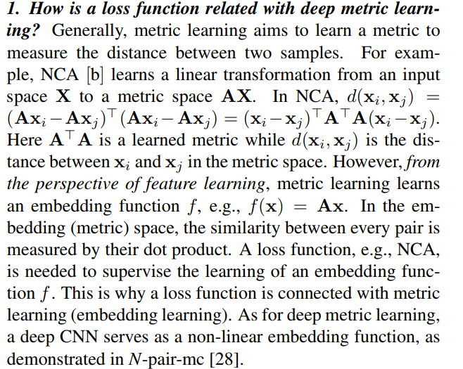

# Ranked-List-Loss-for-Deep-Metric-Learning

### [[Paper]](https://arxiv.org/abs/1903.03238) [[Slides]](https://drive.google.com/file/d/1nSXCe-7t_EkNwjFuXTnmzzoFr-6jFKVW/view?usp=sharing) [[Poster]](https://drive.google.com/file/d/1vSp3mDRJKdQFNUH12ehuDDyqQfjXFnWM/view?usp=sharing)


## Dependencies
The core functions are implemented in the [caffe](https://github.com/BVLC/caffe) framework. We use matlab interfaces matcaffe for data preparation.  
* [CaffeMex_v2](https://github.com/sciencefans/CaffeMex_v2/tree/9bab8d2aaa2dbc448fd7123c98d225c680b066e4)
* [MATLAB 2017b](https://uk.mathworks.com/products/new_products/release2017b.html)


## Setup

* Clone our repository and the submodule: Simply copy and execute following commands in the command line

    ```bash
    git clone git@github.com:XinshaoAmosWang/Ranked-List-Loss-for-D
    eep-Metric-Learning.git
    cd Ranked-List-Loss-for-Deep-Metric-Learning/
    git submodule add git@github.com:sciencefans/CaffeMex_v2.git
    git submodule init
    git submodule update
    git submodule update --remote --merge 
    ```

* Put the files of new layers to the corresponding directories of submodule
[CaffeMex_v2](https://github.com/sciencefans/CaffeMex_v2/tree/9bab8d2aaa2dbc448fd7123c98d225c680b066e4)
    
    
    ```bash
    cp New_Layers_by_XinshaoAmosWang/*.cpp CaffeMex_v2/src/caffe/layers/
    cp New_Layers_by_XinshaoAmosWang/*.hpp CaffeMex_v2/include/caffe/layers/
    cp New_Layers_by_XinshaoAmosWang/caffe.proto CaffeMex_v2/src/caffe/proto/
    cp New_Layers_by_XinshaoAmosWang/Makefile.config CaffeMex_v2/
    ```

* [Install dependencies on Ubuntu 16.04](http://caffe.berkeleyvision.org/install_apt.html ) 
    ```bash
    sudo apt-get install libprotobuf-dev libleveldb-dev libsnappy-dev libopencv-dev libhdf5-serial-dev protobuf-compiler
    sudo apt-get install --no-install-recommends libboost-all-dev
    sudo apt-get install libopenblas-dev
    sudo apt-get install python-dev
    sudo apt-get install libgflags-dev libgoogle-glog-dev liblmdb-dev
    ```
* Install [MATLAB 2017b](https://uk.mathworks.com/products/new_products/release2017b.html)

    Download and Run the install binary file
    ```bash
    ./install
    ```

* Compile Caffe and matlab interface
    
    Note you may need to change some paths in Makefile.config according your system environment and MATLAB path 

    ```bash
    cd CaffeMex_v2
    make -j8  && make matcaffe
    ```

## Usage

Examples for reproducing our results on [Stanford Online Product dataset](http://cvgl.stanford.edu/projects/lifted_struct/) are given. 

* Data preparation
    
    Downlaod Stanford_Online_Products dataset from ftp://cs.stanford.edu/cs/cvgl/Stanford_Online_Products.zip

    For simplicity, you can use the data mat file in pre_post_process directory, which is ready training and testing scripts. 
    To solve the data path, you can do eithor a or b:
        
        a. Changing the path within the mat files. 
        b. A Simpler way: Create a soft link of your data
        e.g sudo ln -s /.../Stanford_Online_Products /home/xinshao/Papers_Projects/Data/Stanford_Online_Products

* Train & Test
    
    Run the training and testing scripts in the training folder of a specific setting defined by its corresponding prototxt folder. 


## Citation
If you find our code and paper useful in your research, please kindly cite our paper:

```bash
InProceedings{Wang_2019_CVPR,
author = {Wang, Xinshao and Hua, Yang and Kodirov, Elyor and Hu, Guosheng and Garnier, Romain and Robertson, Neil M.},
title = {Ranked List Loss for Deep Metric Learning},
booktitle = {The IEEE Conference on Computer Vision and Pattern Recognition (CVPR)},
month = {June},
year = {2019}
}
```

## Common questions

#### 1. What does ranking mean? 
The overall objective is make the postive set ranks before the negative set by a distance margin. We do not consider the exact order of examples within the positive set and negative set. 

#### 2. What are the key components which influence the performance a lot?
* Sample mining;
* Sample weighting;
* Two distance hyper-parameters for optimisation and regularisation jointly;
* Exploiting a weighted combination of more data points.  

#### 3. How is a loss function related with deep metric learning?
    


## More Qualitative results
[[Slides]](https://drive.google.com/file/d/1nSXCe-7t_EkNwjFuXTnmzzoFr-6jFKVW/view?usp=sharing) [[Poster]](https://drive.google.com/file/d/1vSp3mDRJKdQFNUH12ehuDDyqQfjXFnWM/view?usp=sharing)

## Our trained model on SOP

You can use the test scripts to test the performance of our trained model. 

## Acknowledgements

Our work benefits from:

* Hyun Oh Song, Yu Xiang, Stefanie Jegelka and Silvio Savarese. Deep Metric Learning via Lifted Structured Feature Embedding. In IEEE Conference on Computer Vision and Pattern Recognition (CVPR), 2016. http://cvgl.stanford.edu/projects/lifted_struct/

* CaffeMex_v2 library: https://github.com/sciencefans/CaffeMex_v2/tree/9bab8d2aaa2dbc448fd7123c98d225c680b066e4

* Caffe library: https://caffe.berkeleyvision.org/

## Licence
BSD 3-Clause "New" or "Revised" License

## Contact
Xinshao Wang (You can call me Amos as well): xwang39 at qub.ac.uk